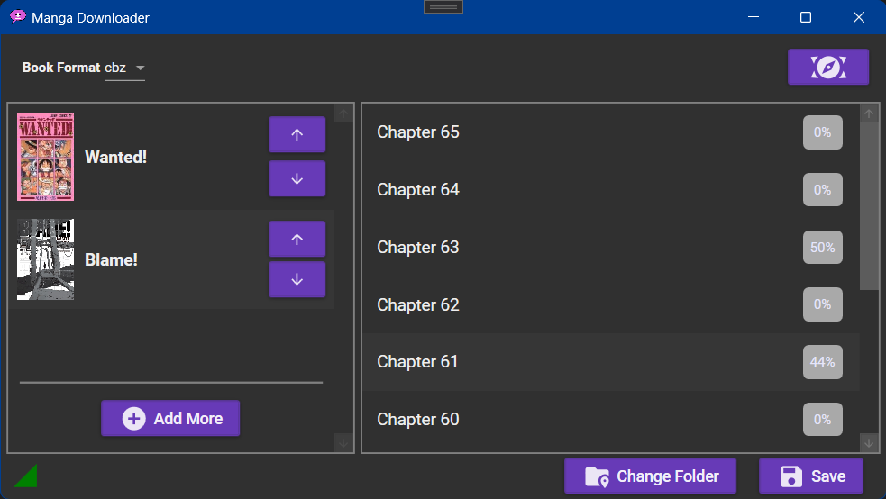

# MangaDownloader

MangaDownloader is an application for downloading manga titles.

## How To Use

+ Clone this repository and build the project using Visual Studio.
+ Launch the application from the `bin/Debug` directory.
+ Visit `mangapill.com` to pick a manga you want and copy the address of the manga page.
+ Click "Add More" in the `MangaDownloader` application, paste the address that you copied in the input box, and hit enter.

## Related Projects

+ [manga-dl](http://github.com/B3zaleel/manga-dl)
